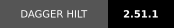
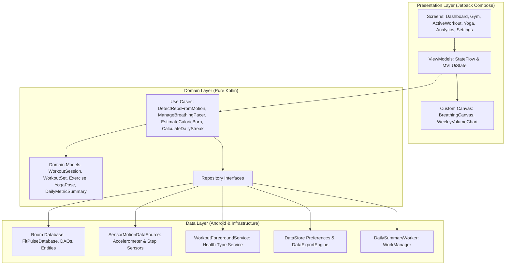

# FitPulse ⚡

<p align="center">
  
  
  
  
  
  
  
</p>

<p align="center">
  <strong>FitPulse</strong> is a state-of-the-art, 100% offline-first Android fitness, strength training, and mindfulness application. Engineered with modern Kotlin, Jetpack Compose, Clean Architecture, and on-device Digital Signal Processing (DSP) for sensor-driven rep counting and animated breathing pacing.
</p>

---

## 🌟 Key Highlights

- **🦾 Real-Time Accelerometer Rep Detection (DSP)**: Custom single-pole IIR low-pass filter and finite-state machine (FSM) running locally to count repetitions, monitor cadence (RPM), and classify form tempo.
- **🛡️ 100% Offline-First & Privacy Sovereign**: Zero cloud telemetry, zero remote tracking. All workouts, biometric data, and routines remain strictly on your device in a local Room database with full JSON and CSV export/import capabilities.
- **⏱️ Foreground Workout Service**: Android 14/15 health foreground service (`FOREGROUND_SERVICE_TYPE_HEALTH`) ensuring persistent session tracking, background timer synchronization, and lock-screen rest countdowns.
- **🧘 Interactive Yoga & Breathing Canvas**: 20 Hz Compose Canvas visualization rendering fluid radial-gradient breathing pacers for Box Breathing, 4-7-8 Relaxation, and Kapalabhati cadences, alongside a curated pose catalog.
- **📊 Dynamic Analytics & Weekly Volume**: Hardware-accelerated custom Canvas volume bar charts, 30-day consistency calculations, daily streak trackers, and ACSM MET-based caloric burn estimation.

---

## 📸 Core Modules & Feature Breakdown

### 1. 🏋️ Gym Tracker & Active Workout
- **Active Workout Suite**: Track multi-set exercises with target weight, reps, RPE (Rate of Perceived Exertion 1–10), and set types (`WARMUP`, `NORMAL`, `DROP_SET`, `FAILURE`).
- **Interactive Rest Timer**: Auto-triggered rest countdown with quick-adjust controls (`+15s`, `-15s`, `Skip`), haptic pulses, and notifications.
- **Pre-Built & Custom Routines**: Pre-seeded compound movements (Bench Press, Squat, Deadlift, OHP, RDL) and exercise library filtered by primary muscle groups (`CHEST`, `BACK`, `LEGS`, `SHOULDERS`, `BICEPS`, `TRICEPS`, `CORE`).

### 2. ⚡ Motion DSP Rep Counter
- **Sensor Ingestion**: Real-time 3-axis accelerometer streaming via Kotlin Flow.
- **Gravity Isolation**: Low-pass filtering ($\alpha = 0.85$) separates static gravitational acceleration from dynamic movement vectors.
- **Hysteresis FSM**: State machine tracking exercise phases:
  $$\text{IDLE} \longrightarrow \text{ECCENTRIC} \longrightarrow \text{INFLECTION VALLEY} \longrightarrow \text{CONCENTRIC} \longrightarrow \text{INFLECTION PEAK} \longrightarrow \text{REP RECORDED}$$
- **Form Quality Classification**: Evaluates rep duration and peak jerk to flag `EXCELLENT`, `GOOD`, `RUSHED_TEMPO`, or `INCOMPLETE_ROM`.

### 3. 🧘 Yoga Studio & Mindful Breathing Canvas
- **Fluid Breathing Canvas**: Real-time custom drawing with dynamic pulsing gradient auras synchronized with respiratory phases (`INHALE`, `HOLD_IN`, `EXHALE`, `HOLD_OUT`).
- **Standardized Breathwork Protocols**:
    - **Box Breathing (Samavritti)**: 4s - 4s - 4s - 4s for nervous system regulation.
    - **4-7-8 Deep Relaxation**: Dr. Weil's tranquilizing rhythm for parasympathetic recovery.
    - **Energizing Breath (Kapalabhati)**: 2s active exhalations with quick rhythm.
    - **Calm Pacing (2-1-4-1)**: Extended exhalations for heart rate reduction.
- **Pose Catalog**: Interactive countdown hold timers, Sanskrit and English titles, alignment cues, and targeted anatomical focus.

### 4. 📈 Analytics & Daily Dashboard
- **Habit & Streak Engine**: Dynamic calculation of current consecutive streaks, all-time best streaks, and 30-day consistency percentages.
- **Weekly Volume Tonnage**: Custom rounded Canvas bar chart rendering total kg lifted per day over the previous 7-day cycle.
- **Daily 2x2 Metric Hub**: Step tracking progress ring, active exercise minutes, ACSM MET-formula calorie estimates, and interactive quick-tap hydration logger (`+250ml`).
- **Background Worker**: Android WorkManager `DailySummaryWorker` scheduling periodic evening streak summaries and milestone alerts.

### 5. 🔒 Data Sovereignty & Portability
- **JSON Full Backup & Restore**: Complete atomic export and import of all user exercises, custom routines, logged sets, yoga sessions, and daily metric summaries.
- **CSV Workout Export**: Spreadsheet-ready tabular exports for personal strength analysis.
- **DataStore Preferences**: Fast asynchronous storage for units (`KG` vs `LBS`), sound toggles, and tactile haptic feedback.

---

## 🏛️ Architecture & Tech Stack

The application strictly adheres to **Clean Architecture** combined with **MVI/MVVM** reactive presentation:



### Technology Matrix

| Layer / Concern | Technology / Library | Version | Role / Implementation |
|---|---|---|---|
| **Language** | Kotlin | `2.0.20` | Modern idiomatic Kotlin with coroutines & serialization |
| **UI Toolkit** | Jetpack Compose | BOM `2024.08.00` | 100% declarative UI with Material 3 & Navigation Compose |
| **Architecture** | Clean Architecture + MVVM | — | Unidirectional data flow with immutable `UiState` and `StateFlow` |
| **Dependency Injection** | Dagger Hilt | `2.51.1` | Modular dependency graph injection across Activities, ViewModels & Workers |
| **Local Persistence** | AndroidX Room | `2.6.1` | Offline SQLite database with relational queries and KSP compiler |
| **Key-Value Storage** | Preferences DataStore | `1.1.1` | Asynchronous storage for user units, sound, and haptic preferences |
| **Background Work** | AndroidX WorkManager | `2.9.1` | Reliable periodic daily goal and streak notifications via HiltWorker |
| **Sensors & Hardware** | Android Sensor Framework | Hardware | 3-axis accelerometer and step counter integration |
| **Foreground Service** | AndroidX ServiceCompat | SDK 35 | Health foreground service (`FOREGROUND_SERVICE_TYPE_HEALTH`) |
| **JSON Serialization** | Kotlinx Serialization | `1.7.1` | Portable zero-reflection JSON encoding for backups |
| **Unit Testing** | JUnit 5 / JUnit 4 + Turbine | `5.10.3` / `1.1.0` | StateFlow testing, Coroutines Test dispatchers, and MockK |

---

## 🎨 Design System & Aesthetic Palette

FitPulse employs an **Obsidian Athletic Neon** aesthetic tailored for high contrast, low ocular strain in gym environments, and deep mindfulness focus.

- 🟩 ` #C6FF00 ` **Neon Lime**: Primary energy, active buttons, completed sets, peak reps
- 🟦 ` #00E5FF ` **Electric Cyan**: Sensors, breathing inhalations, hydration metrics
- 🟧 ` #FF6D00 ` **Cyber Orange**: Caloric burn, active streaks, rest alerts
- 🟥 ` #FF1744 ` **Pulse Red**: Incomplete form warnings, cancellation actions
- ⬛ ` #121214 ` **Obsidian Black**: Deep OLED dark background
- 🔳 ` #1A1A1E ` **Surface Dark**: Card and container backgrounds

---

## 📂 Project Structure

```
kotlin_workplace/
├── app/
│   ├── src/
│   │   ├── main/
│   │   │   ├── AndroidManifest.xml
│   │   │   └── java/com/fitpulse/app/
│   │   │       ├── FitPulseApplication.kt          # Hilt Application, notification channels & WorkManager config
│   │   │       ├── core/
│   │   │       │   ├── di/                         # Hilt dependency injection modules (Database, Dispatchers, etc.)
│   │   │       │   └── dispatcher/                 # Coroutine dispatchers abstraction (IO, Default, Main)
│   │   │       ├── data/
│   │   │       │   ├── datastore/                  # Preferences DataStore manager
│   │   │       │   ├── export/                     # JSON & CSV backup serialization engine
│   │   │       │   ├── local/                      # Room database, type converters, DAOs & Entities
│   │   │       │   │   ├── dao/                    # WorkoutDao, YogaDao, DailyMetricDao
│   │   │       │   │   ├── entity/                 # ExerciseEntity, WorkoutSessionEntity, WorkoutSetEntity, etc.
│   │   │       │   │   └── relation/               # RoutineWithExercises, WorkoutSessionWithSets
│   │   │       │   ├── sensor/                     # SensorDataSource, LowPassFilter, PeakValleyDetector
│   │   │       │   ├── service/                    # WorkoutForegroundService (Health Service)
│   │   │       │   └── worker/                     # DailySummaryWorker (WorkManager)
│   │   │       ├── domain/
│   │   │       │   ├── model/                      # Immutable domain models (Workout, Motion, Yoga, Metrics)
│   │   │       │   ├── repository/                 # Domain repository interfaces
│   │   │       │   └── usecase/                    # Pure business logic use cases (Rep counting, streak, METs, etc.)
│   │   │       └── presentation/
│   │   │           ├── MainActivity.kt             # Single-Activity entry point
│   │   │           ├── navigation/                 # Navigation graph (FitPulseNavHost, Screen routes)
│   │   │           ├── theme/                      # Obsidian dark color tokens, typography & shapes
│   │   │           ├── components/                 # FitPulseCard, MetricTile, WeeklyVolumeChart, RestTimer
│   │   │           ├── dashboard/                  # DashboardScreen & DashboardViewModel
│   │   │           ├── gym/                        # GymTrackerScreen, ActiveWorkoutScreen & ActiveWorkoutViewModel
│   │   │           ├── yoga/                       # YogaStudioScreen, YogaStudioViewModel & BreathingCanvas
│   │   │           ├── analytics/                  # AnalyticsScreen & AnalyticsViewModel
│   │   │           └── settings/                   # SettingsScreen & SettingsViewModel
│   │   └── test/java/com/fitpulse/app/             # Unit tests for UseCases & ViewModels
│   └── build.gradle.kts                            # App-level dependencies and build configs
├── build.gradle.kts                                # Root buildscript
└── settings.gradle.kts                             # Gradle repositories & module settings
```

---

## 🚀 Getting Started

### Prerequisites
- **Android Studio**: Ladybug (2024.2.1) or newer
- **JDK**: Version 17
- **Android Device / Emulator**: Minimum SDK 26 (Android 8.0 Oreo), Target SDK 35 (Android 15)
- **Sensors**: Physical accelerometer recommended for live motion rep-counting verification

### Build & Run
1. **Clone the repository**:
   ```bash
   git clone https://github.com/Khushipatel3821/kotlin_workplace.git
   cd kotlin_workplace
   ```
2. **Open in Android Studio** and allow Gradle to sync.
3. **Assemble Debug APK**:
   ```bash
   ./gradlew assembleDebug
   ```
4. **Install on connected device**:
   ```bash
   ./gradlew installDebug
   ```

---

## 🧪 Testing & Code Quality

FitPulse includes comprehensive unit tests verifying the mathematical models, sensor digital signal processing algorithms, and reactive ViewModels:

```bash
# Execute all local unit tests
./gradlew testDebugUnitTest
```

### Verified Test Suites
- **`DetectRepsFromMotionUseCaseTest`**: Validates accelerometer wave ingestion, gravity low-pass vector stabilization, jitter rejection, and FSM transition integrity.
- **`CalculateDailyStreakUseCaseTest`**: Tests historical consistency calculations, epoch day boundaries, and streak incrementing.
- **`EstimateCaloricBurnUseCaseTest`**: Validates ACSM MET equations across exercise categories, body weights, and RPE intensities.
- **`ActiveWorkoutViewModelTest`**: Tests session lifecycle, set creation, set completion, and rest timer triggering using CashApp Turbine and MockK.
- **`YogaStudioViewModelTest`**: Validates breathing pacer state emissions and pose timer transitions.

---

## 🔐 Android Permissions & Hardware Usage

FitPulse requires the following permissions declared in `AndroidManifest.xml` to provide background tracking and sensor analysis:

- `android.permission.ACTIVITY_RECOGNITION`: For pedometer and physical activity tracking.
- `android.permission.BODY_SENSORS`: For real-time accelerometer motion sampling.
- `android.permission.FOREGROUND_SERVICE`: Keeps active workouts running without system termination.
- `android.permission.FOREGROUND_SERVICE_HEALTH`: Compliant with Android 14+ specific foreground service type requirements.
- `android.permission.POST_NOTIFICATIONS`: Delivers persistent rest timer counters and daily streak summaries.
- `android.permission.VIBRATE`: Provides physical tactile feedback on rep completion and rest timer finish.

---

## 📄 License

This project is distributed under the [MIT License](LICENSE). Feel free to inspect, fork, and build upon the offline-first fitness architecture.